# Design Document: TodayScreen UI Spacing and Visual Design Fixes

## Overview

The TodayScreen currently suffers from excessive bottom spacing, poor visual hierarchy, and an unpolished input area design. This design addresses three critical UI/UX issues: (1) eliminating the unnecessary gap between the task list and bottom input area, (2) repositioning the FAB to reduce wasted space, and (3) transforming the bottom input box from a basic wrapper into a polished, card-like component with improved glassmorphism effects, proper spacing, and better visual hierarchy that matches the quality of task cards.

## Architecture

The UI consists of three main vertical zones with specific spacing relationships:

```mermaid
graph TB
    A[Header + Title - Fixed Top]
    B[Scrollable Task List - Flex Growth]
    C[Bottom Action Zone - Fixed Bottom]
    
    A -->|margin: 32px| B
    B -->|NO GAP - Seamless Transition| C
    C -.->|FAB: absolute bottom 16px| D[Floating Action Button]
    
    style A fill:#2A2A2A
    style B fill:#1E1E1E
    style C fill:#1E1E1E
    style D fill:#3B82F6
```



**Key Spatial Relationships:**
- Header and title remain fixed at top with existing margins
- Task list scrolls and takes remaining vertical space
- Bottom action zone (FAB or input box) anchors to screen bottom with minimal padding
- No artificial gaps between zones - seamless visual flow

## Components and Interfaces

### Component 1: ScrollView Container

**Purpose**: Displays the scrollable list of tasks with optimized bottom padding

**Current State (Problematic)**:
- `paddingBottom: 100` - Creates excessive white space
- Forces content far from bottom action zone
- Breaks visual continuity

**New State (Fixed)**:
- `paddingBottom: 16` - Minimal breathing room only
- Content flows naturally to bottom edge
- Maintains visual cohesion

**Responsibilities**:
- Render task cards in scrollable area
- Provide just enough padding to prevent content from touching bottom zone
- Allow last task to be visible above FAB/input area

---

### Component 2: FAB (Floating Action Button)

**Purpose**: Provides quick access to add new task

**Current State (Problematic)**:
- `bottom: 32, right: 24` - Creates unnecessary gap
- Floats too high above screen bottom
- Increases perceived dead space

**New State (Fixed)**:
- `bottom: 16, right: 20` - Closer to natural thumb reach zone
- Reduces wasted vertical space by 16px
- Better ergonomics for mobile interaction

**Responsibilities**:
- Trigger task input mode
- Maintain sufficient safe area for iOS notch/Android gesture bar
- Position for optimal thumb reach

---

### Component 3: Bottom Input Wrapper (Enhanced Glassmorphism Card)

**Purpose**: Houses the task input form with enhanced visual polish matching task cards

**Current State (Problematic)**:
```javascript
bottomInputWrapper: {
  paddingTop: 12,
  paddingBottom: Platform.OS === 'ios' ? 24 : 16,
  borderTopLeftRadius: 16,
  borderTopRightRadius: 16,
  backgroundColor: '#1E1E1E',
  shadowColor: "#000",
  shadowOffset: { width: 0, height: -4 },
  shadowOpacity: 0.2,
  shadowRadius: 8,
  elevation: 16,
}
```

**Issues**:
- Minimal padding creates cramped feeling
- Basic shadow lacks depth and polish
- Flat background doesn't match task card glassmorphism
- No border treatment creates harsh edge
- Insufficient visual weight for important UI element

**New State (Enhanced Design)**:
```javascript
bottomInputWrapper: {
  paddingTop: 20,
  paddingHorizontal: 16,
  paddingBottom: Platform.OS === 'ios' ? 32 : 20,
  borderTopLeftRadius: 24,
  borderTopRightRadius: 24,
  backgroundColor: 'rgba(30, 30, 30, 0.95)',  // Semi-transparent for glassmorphism
  borderTopWidth: 1,
  borderTopColor: 'rgba(255, 255, 255, 0.08)',  // Subtle glass edge
  backdropFilter: 'blur(20px)',  // Glass blur effect (iOS)
  shadowColor: "#000",
  shadowOffset: { width: 0, height: -8 },
  shadowOpacity: 0.4,
  shadowRadius: 16,
  elevation: 24,
}
```

**Visual Enhancements**:
1. **Improved Glassmorphism**: Semi-transparent background with subtle top border creates glass-like material
2. **Enhanced Depth**: Stronger shadow (offset -8, opacity 0.4, radius 16) provides clear visual hierarchy
3. **Better Spacing**: Increased padding (top: 20, bottom: 32/20) prevents cramped UI
4. **Rounded Corners**: Increased radius (24 vs 16) matches modern card design
5. **Visual Weight**: Combined effects give component appropriate importance as primary input zone

**Responsibilities**:
- Anchor to screen bottom with safe area awareness
- Provide visually distinct card-like container
- Match visual quality of task cards
- House input field, toolbar, and pending tags
- Maintain glassmorphism aesthetic throughout app

---

### Component 4: Input Row (Enhanced Layout)

**Purpose**: Contains the close button, input field, and submit button

**Current State**: Basic horizontal layout with minimal spacing

**New State (Enhanced Spacing)**:
```javascript
inputRow: {
  flexDirection: 'row',
  alignItems: 'center',
  paddingHorizontal: 20,  // Increased from 16
  paddingVertical: 8,      // Added vertical padding
  marginBottom: 16,        // Increased from 12
  gap: 12,                 // Consistent spacing between elements
}
```

**Visual Improvements**:
- Increased horizontal padding for better breathing room
- Added vertical padding for touch target size
- Larger gap between elements for clarity
- Better visual hierarchy within input zone

---

### Component 5: Toolbar Row (Enhanced Spacing)

**Purpose**: Displays Due date, Remind me, Repeat buttons

**Current State**: Basic horizontal layout

**New State (Enhanced Spacing)**:
```javascript
toolbarRow: {
  flexDirection: 'row',
  paddingHorizontal: 20,  // Increased from 16
  paddingBottom: 8,       // Added bottom padding
  gap: 20,                // Increased from 16
}
```

**Visual Improvements**:
- Aligned padding with input row
- Increased gap between buttons for better tap targets
- Added bottom padding for separation from screen edge

## Data Models

### Spacing Configuration Model

```javascript
interface SpacingConfig {
  scroll: {
    paddingBottom: number;      // 16 (reduced from 100)
  };
  
  fab: {
    bottom: number;             // 16 (reduced from 32)
    right: number;              // 20 (reduced from 24)
    size: number;               // 64 (unchanged)
  };
  
  bottomInput: {
    paddingTop: number;         // 20 (increased from 12)
    paddingHorizontal: number;  // 16 (explicit)
    paddingBottom: {
      ios: number;              // 32 (increased from 24)
      android: number;          // 20 (increased from 16)
    };
    borderRadius: number;       // 24 (increased from 16)
  };
  
  inputRow: {
    paddingHorizontal: number;  // 20 (increased from 16)
    paddingVertical: number;    // 8 (new)
    marginBottom: number;       // 16 (increased from 12)
    gap: number;                // 12 (explicit)
  };
  
  toolbar: {
    paddingHorizontal: number;  // 20 (increased from 16)
    paddingBottom: number;      // 8 (new)
    gap: number;                // 20 (increased from 16)
  };
}
```

**Validation Rules**:
- All padding values must be multiples of 4 for design system consistency
- FAB bottom must account for safe area insets (minimum 16px)
- Bottom input padding must accommodate platform-specific safe areas
- Total scroll padding + FAB height must prevent content occlusion

---

### Visual Design Model

```javascript
interface GlassmorphismStyle {
  backgroundColor: string;      // 'rgba(30, 30, 30, 0.95)'
  borderTopWidth: number;       // 1
  borderTopColor: string;       // 'rgba(255, 255, 255, 0.08)'
  backdropFilter?: string;      // 'blur(20px)' (iOS only)
  borderRadius: number;         // 24
  
  shadow: {
    color: string;              // '#000'
    offset: {
      width: number;            // 0
      height: number;           // -8
    };
    opacity: number;            // 0.4
    radius: number;             // 16
  };
  
  elevation: number;            // 24 (Android)
}
```

**Validation Rules**:
- Background opacity must be >= 0.90 for content readability
- Border opacity must be subtle (0.05 - 0.12 range)
- Shadow offset must be negative for upward shadow
- Shadow opacity must provide clear depth (0.3 - 0.5 range)
- Border radius must match card system (multiples of 4)

## Error Handling

### Error Scenario 1: Insufficient Safe Area on iOS

**Condition**: When device has notch/dynamic island and safe area insets are < 20px  
**Response**: Automatically increase bottomInputWrapper paddingBottom to ensure content doesn't overlap with home indicator  
**Recovery**: Use `useSafeAreaInsets()` hook to dynamically adjust padding: `Math.max(insets.bottom + 8, 32)`

### Error Scenario 2: Content Occlusion

**Condition**: When last task in list is obscured by FAB or input box  
**Response**: ScrollView's reduced paddingBottom (16px) combined with FAB repositioning ensures visibility  
**Recovery**: If user scrolls to bottom, last task remains visible with 16px clearance above FAB

### Error Scenario 3: Keyboard Overlap

**Condition**: When keyboard appears and covers input area  
**Response**: KeyboardAvoidingView already in place handles this automatically  
**Recovery**: Behavior='padding' for iOS ensures input area stays above keyboard

## Testing Strategy

### Unit Testing Approach

Focus on verifying spacing values and style calculations:

1. **Spacing Constants Test**: Verify all spacing values match design specifications
2. **Platform-Specific Padding Test**: Confirm iOS vs Android padding differences
3. **Safe Area Calculation Test**: Test that safe area insets are properly incorporated
4. **Style Object Generation Test**: Verify computed styles match expected glassmorphism properties

**Key Test Cases**:
- FAB position calculates correctly for different screen sizes
- Bottom input padding adapts to platform
- Scroll padding prevents content occlusion
- Glassmorphism styles are properly applied

### Integration Testing Approach

Test the visual hierarchy and user interactions:

1. **Visual Regression Tests**: Snapshot tests comparing before/after designs
2. **Scroll Behavior Tests**: Verify last task is visible when scrolling to bottom
3. **FAB Interaction Tests**: Ensure FAB triggers input mode correctly
4. **Input Area Animation Tests**: Verify smooth transition when opening/closing input
5. **Touch Target Tests**: Confirm all interactive elements meet minimum touch size (44x44)

**Key Integration Scenarios**:
- User scrolls through long task list and taps FAB
- User adds task and input area closes smoothly
- User taps toolbar buttons without accidental touches
- Safe area insets are respected on various device models

## Performance Considerations

**Optimization Strategies**:
1. **Shadow Optimization**: Use `shadowOpacity` and `elevation` instead of complex shadow shapes to minimize render cost
2. **Glassmorphism on iOS**: `backdropFilter` may impact performance on older devices - consider fallback for iPhone X and earlier
3. **Layout Thrashing**: Batch style changes when transitioning between FAB and input mode to prevent multiple re-renders
4. **ScrollView Performance**: With reduced paddingBottom, fewer pixels are rendered off-screen

**Performance Targets**:
- FAB tap to input mode transition: < 16ms (60fps)
- Scroll performance: Maintain 60fps with 100+ tasks
- Input area render time: < 50ms on mid-range devices

## Security Considerations

No security implications for UI spacing changes. This is a purely visual enhancement.

## Dependencies

**React Native Dependencies** (Already Present):
- `react-native`: Core framework
- `react-native-safe-area-context`: For safe area insets handling
- Platform-specific styling utilities

**Third-party Dependencies** (Already Present):
- `lucide-react-native`: Icons remain unchanged

**No New Dependencies Required**

## Implementation Notes

### iOS-Specific Considerations

1. **Backdrop Filter**: The `backdropFilter: 'blur(20px)'` property is iOS-specific and provides the true glassmorphism effect. Android will rely on the semi-transparent background and shadow for visual depth.

2. **Safe Area**: iOS devices with notches/dynamic island require extra bottom padding (32px vs 20px on Android) to keep content above the home indicator.

### Android-Specific Considerations

1. **Elevation**: Android uses `elevation: 24` to create shadow depth. The shadow cannot point upward on Android, so the visual effect differs slightly from iOS.

2. **Gesture Navigation**: Modern Android devices with gesture navigation need adequate bottom padding (20px) to prevent accidental swipes.

### Cross-Platform Testing

Priority devices for testing:
- **iOS**: iPhone 15 Pro (dynamic island), iPhone SE (no notch), iPad
- **Android**: Pixel 6 (modern gestures), Samsung Galaxy (different aspect ratio)

## Visual Specifications

### Spacing Values Summary

| Element | Current | New | Change | Rationale |
|---------|---------|-----|--------|-----------|
| Scroll paddingBottom | 100 | 16 | -84px | Eliminate excessive gap |
| FAB bottom | 32 | 16 | -16px | Closer to natural reach zone |
| FAB right | 24 | 20 | -4px | Better screen edge alignment |
| Input paddingTop | 12 | 20 | +8px | More breathing room |
| Input paddingBottom (iOS) | 24 | 32 | +8px | Better safe area clearance |
| Input paddingBottom (Android) | 16 | 20 | +4px | Adequate gesture area |
| Input borderRadius | 16 | 24 | +8px | Modern card aesthetic |

### Color & Effect Values

| Property | Value | Purpose |
|----------|-------|---------|
| Background | `rgba(30, 30, 30, 0.95)` | Semi-transparent for glassmorphism |
| Top Border Color | `rgba(255, 255, 255, 0.08)` | Subtle glass edge highlight |
| Shadow Color | `#000` | Standard black shadow |
| Shadow Offset | `{ width: 0, height: -8 }` | Upward shadow for elevated feel |
| Shadow Opacity | `0.4` | Strong enough for depth perception |
| Shadow Radius | `16` | Soft, diffused shadow edges |
| Backdrop Filter | `blur(20px)` | iOS glassmorphism (true blur) |
| Elevation | `24` | Android shadow depth |

## Migration Strategy

### Phase 1: Core Spacing Fixes
1. Update ScrollView paddingBottom: 100 → 16
2. Update FAB position: bottom 32 → 16, right 24 → 20
3. Update bottomInputWrapper paddingTop: 12 → 20
4. Update platform-specific paddingBottom

### Phase 2: Visual Enhancement
1. Add glassmorphism properties to bottomInputWrapper
2. Update borderRadius: 16 → 24
3. Enhance shadow properties
4. Add top border treatment

### Phase 3: Fine-Tuning
1. Update inputRow spacing
2. Update toolbar spacing
3. Test on multiple devices
4. Adjust safe area handling if needed

### Rollback Plan
If issues arise, original style values are preserved in git history and can be quickly restored.

## Correctness Properties

### Property 1: Content Visibility Preservation

For any task list with N tasks, after applying spacing changes, all tasks must remain accessible via scrolling and the last task must have at least 16px clearance above the FAB or input area.

**Validates: Requirements 1.3, 9.1, 9.3, 9.4**

### Property 2: Safe Area Compliance

For any iOS device with safe area insets, the bottom input area must have padding >= (insets.bottom + 8px) to ensure content doesn't overlap with system UI elements.

**Validates: Requirements 6.1, 6.2, 6.3**

### Property 3: Visual Hierarchy Consistency

For any screen state (FAB visible or input visible), the bottom action zone must have visual weight (shadow depth + glassmorphism) equal to or greater than task cards to maintain proper UI hierarchy.

**Validates: Requirements 7.1, 7.2, 7.3**

### Property 4: Touch Target Adequacy

For any interactive element in the bottom input area, the touch target must be >= 44x44 pixels to meet iOS Human Interface Guidelines and Android Material Design standards.

**Validates: Requirements 4.5**

### Property 5: Platform-Specific Styling

For any device platform (iOS or Android), the bottom input padding and visual effects must use platform-appropriate values: iOS uses 32px bottom padding with backdropFilter, Android uses 20px bottom padding with elevation.

**Validates: Requirements 8.1, 8.2, 8.3, 8.4, 8.5**
